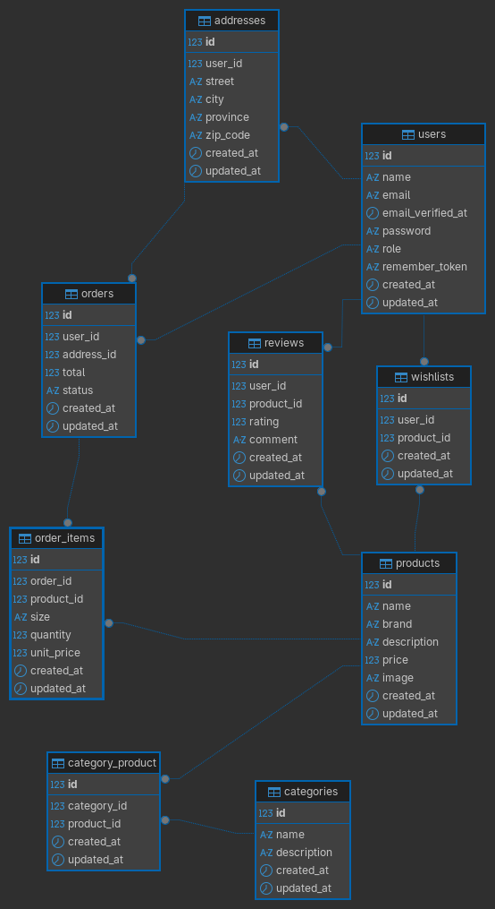

# Trabajo Final - ZapasApp (E-commerce de Zapatillas)

## 1. Descripción del Proyecto y Alcance Funcional
ZapasApp es un sistema completo de e-commerce desarrollado en Laravel 11. 

**Alcance funcional:**
- **Clientes:** Pueden registrarse, iniciar sesión, navegar el catálogo filtrando por categorías, agregar productos a una lista de deseos, armar un carrito de compras con talle y cantidad, realizar pedidos y dejar reseñas (calificación y comentario) en los productos comprados.
- **Administradores:** Poseen un panel exclusivo (protegido por Middleware) con un CRUD completo para Categorías y Productos, además de un gestor de Pedidos para visualizar y actualizar el estado de los envíos (pendiente, pagado, enviado, entregado, cancelado).
- **Fuera de alcance:** No se implementó una pasarela de pago real (la orden se genera al confirmar el carrito).

## 2. Instrucciones de Instalación
Siga estos pasos para levantar el proyecto localmente:

1. Clonar el repositorio.
2. Instalar dependencias de PHP:
    composer install

3. Instalar dependencias de Node.js:
    npm install && npm run build

4. Configurar variables de entorno (Copiar el archivo de ejemplo y generar la key):
    cp .env.example .env
    php artisan key:generate

5. Configurar la base de datos en el archivo .env y correr migraciones con seeders:
    php artisan migrate --seed

6. Iniciar el servidor de desarrollo:
    php artisan serve

## 3. Credenciales de Prueba (Generadas por el Seeder)
- **Administrador:** admin@admin.com | Clave: admin123
- **Cliente:** cliente@cliente.com | Clave: cliente123

## 4. Diagrama Entidad-Relación (E-R)

- **users:** Diferenciados por el campo ENUM role.
- **categories y products:** Relación N:M mediante pivote category_product.
- **orders:** Relación 1:N con users y addresses.
- **order_items:** Pivote N:M entre pedidos y productos, guarda precio unitario, cantidad y talle.
- **reviews y wishlists:** Relacionan users con products.

## 5. Decisiones de Diseño Relevantes
- **Arquitectura MVC y Controladores Delgados:** Se delegó toda la lógica de validación de formularios a los FormRequests para mantener los controladores limpios.
- **Route Model Binding:** Se implementó para inyectar modelos directamente en las rutas, evitando consultas redundantes a la base de datos.
- **Diseño UI/UX Custom:** Se optó por una arquitectura de CSS puro modularizado (catalog.css, product.css, admin.css) integrados mediante Vite, logrando un diseño moderno, responsivo y sin frameworks pesados de frontend.
- **Seguridad:** Rutas de administración protegidas por un Middleware custom (EnsureUserIsAdmin).

## 6. Rutas Principales y API REST

**Rutas Web (Principales):**
- GET / : Catálogo de productos.
- GET /producto/{producto} : Detalle y reseñas.
- GET|POST|DELETE /carrito : Gestión del carrito y checkout.
- GET /mis-pedidos : Historial de compras del cliente.
- RESOURCE /categorias y /productos : Panel Admin (CRUD).

**Endpoints API REST (JSON):**
- GET /api/products : Listado completo del catálogo.
- GET /api/products/{id} : Detalle de un producto específico.
- GET /api/orders : Pedidos del usuario (Requiere estar autenticado en la sesión web).
