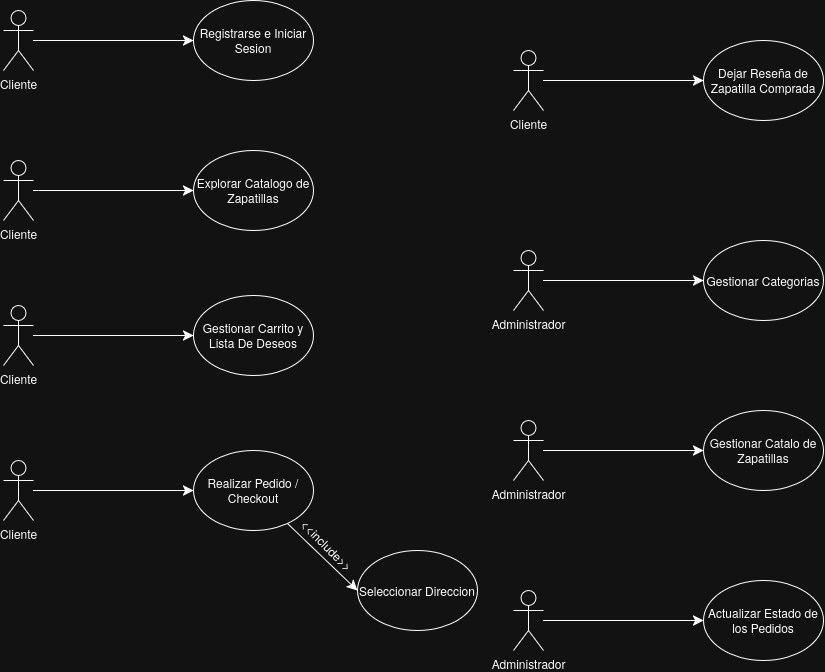

# Análisis y Relevamiento de Requisitos - E-commerce de Calzado

## 3.1 Actores del sistema
* **Cliente:** Usuario registrado que navega el catálogo, realiza compras, gestiona sus direcciones, guarda productos en favoritos y deja reseñas.
* **Administrador:** Usuario con privilegios elevados encargado de gestionar el catálogo (productos y categorías) y administrar el flujo de estados de los pedidos.
* **Sistema:** El propio motor de la aplicación que realiza cálculos automáticos y aplica reglas de negocio.

## 3.2 Requisitos Funcionales (RF)
| ID | Requisito | Actor |
| :--- | :--- | :--- |
| **RF01** | El sistema debe permitir a un visitante registrarse como cliente ingresando nombre, email y contraseña[cite: 1]. | Cliente |
| **RF02** | El sistema debe permitir a los usuarios (clientes y administradores) iniciar y cerrar sesión[cite: 1]. | Cliente / Admin |
| **RF03** | El sistema debe calcular automáticamente el total de un pedido en base a sus ítems[cite: 1]. | Sistema |
| **RF04** | El sistema debe permitir al cliente agregar, visualizar y quitar productos de un carrito de compras temporal[cite: 1]. | Cliente |
| **RF05** | El sistema debe permitir al cliente seleccionar una dirección de envío previamente registrada o ingresar una nueva al momento de confirmar la compra[cite: 1]. | Cliente |
| **RF06** | Al finalizar el checkout, el sistema debe registrar el pedido y asignarle por defecto el estado inicial de "pendiente"[cite: 1]. | Sistema |
| **RF07** | El sistema debe permitir al administrador crear, leer, actualizar y eliminar (CRUD) productos del catálogo[cite: 1]. | Administrador |
| **RF08** | El sistema debe permitir al administrador crear, leer, actualizar y eliminar (CRUD) categorías[cite: 1]. | Administrador |
| **RF09** | El sistema debe permitir al cliente dejar una reseña (calificación y comentario) únicamente en productos que haya comprado y cuyo pedido esté en estado "entregado"[cite: 1]. | Cliente |
| **RF10** | El sistema debe permitir al administrador modificar el estado de un pedido siguiendo el flujo estricto: pendiente, pagado, enviado, entregado o cancelado[cite: 1]. | Administrador |
| **RF11** | El sistema debe permitir al cliente agregar y quitar productos de su lista de deseos (wishlist)[cite: 1]. | Cliente |

## 3.3 Requisitos No Funcionales (RNF)
| ID | Requisito | Categoría |
| :--- | :--- | :--- |
| **RNF01** | La interfaz de usuario garantizará una correcta visualización y usabilidad tanto en dispositivos móviles como de escritorio mediante un diseño responsive[cite: 1]. | Usabilidad |
| **RNF02** | Las rutas de administración estarán protegidas obligatoriamente mediante un middleware de autorización que valide el rol de cada usuario en sesión[cite: 1]. | Seguridad |
| **RNF03** | La validación de los datos de entrada en el backend se realizará de manera exclusiva a través de Form Requests, retornando mensajes de error claros hacia las vistas[cite: 1]. | Robustez |
| **RNF04** | Las contraseñas de los usuarios se almacenarán en la base de datos de forma encriptada, utilizando los algoritmos de hashing nativos provistos por el framework[cite: 1]. | Seguridad |
| **RNF05** | Las respuestas de los endpoints de la API REST se emitirán estrictamente en formato JSON, implementando los códigos de estado HTTP estándar (200, 201, 400, 404, etc.) para cada petición[cite: 1]. | Interoperabilidad |

## 3.4 Casos de uso principales

## 3.5 Alcance y Supuestos
* **Temática del negocio:** El sistema estará orientado exclusivamente a la venta de calzado. Al no manejar control de stock dinámico para simplificar el modelo, el talle (size) y la marca (brand) seleccionados se registrarán como detalles directamente en el pedido.
* **Fuera de alcance:** No se integrará una pasarela de pagos real. Todo el flujo de pago será simulado y gestionado de forma manual por el administrador mediante los cambios de estado.
* **Fuera de alcance:** No se implementará envío de correos electrónicos reales. Las notificaciones se registrarán en los logs del sistema (`MAIL_MAILER=log`).
* **Supuesto:** Se asume que los clientes registrados no requieren un proceso de verificación de correo electrónico para comenzar a operar en la plataforma.
* **Supuesto:** Un producto puede pertenecer a múltiples categorías simultáneamente[cite: 1].